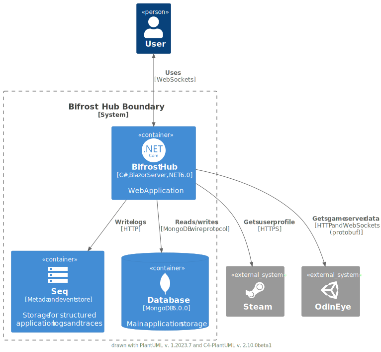

<p align="center">
  
  <h2 align="center">Bifrost Hub</h2>
  <p align="center">Web App to administer Valheim dedicated servers and monitor all of your viking activities.<p>
  <p align="center">
    
    <a href="https://hub.docker.com/r/sparcopt/bifrosthub" >
    </a>
    <a href="https://github.com/sparcopt/bifrost-hub/actions/workflows/build-main.yaml" >
      </a>
    <a href="https://github.com/sparcopt/bifrost-hub/actions/workflows/build-pr.yaml" >
      </a>
  </p>
</p>

<p align="center">
    <a href="readme.md#ℹ%EF%B8%8F-overview">Overview</a> • 
    <a href="readme.md#-features">Features</a> • 
    <a href="readme.md#-demos">Demos</a> •
    <a href="readme.md#getting-started">Getting started</a> •
    <a href="readme.md#%EF%B8%8F-development-notes">Development notes</a> •
    <a href="readme.md#-roadmap">Roadmap</a>
</p>

> [!IMPORTANT]
> This project is currently under development. Beta versions are accessible and ready for use, but please note that breaking changes may be implemented without prior notice.

## ℹ️ Overview

Bifrost Hub is a free, open-source web UI to monitor and manage Valheim dedicated servers. It provides a set of minimalistic and detailed user interfaces that display relevant info about the connected server, the game world, its players and real time data such as game events.
While its primary audience targets Valheim server owners, the application features can also be made accessible and used by server players and other interested users.

## ✨ Features

- **Online player presence**
  - See who's online with player names and avatars
- **Game world details**
  - Monitor the present in-game day and time, including specific periods such as morning, afternoon, and evening
- **Boss progression**
  - Keep an eye on both defeated and active bosses' progress
- **Player browser**
  - Browse and search through all the known server population
  - Search and sort by player fields such as names, online/offline status and last online date
- **Player profiles**
  - See the current online status and last online date
  - Steam profile shortcut
- **Live game events**
  - Observe in-game events as they occur, these include:
    - Player join/disconnect, spawn/death, sleep/awake
    - Server start/shutdown
    - Raids
    - And much more

## 📸 Demos


## 📦Getting started

Bifrost Hub consists of the following elements:
- Web application - docker container that exposes the application on a specific port
- Database - MongoDB (can be a docker container or an existing instance)
- Structured application logs - Seq (can be a docker container or an existing instance)    

Before proceeding, ensure that you fulfill the following requirements:
- ✔️ The Valheim server that Bifrost Hub will connect to has the [OdinEye plugin](https://github.com/sparcopt/odin-eye) installed and running
- ✔️ The server that will host Bifrost Hub has the latest version of Docker installed and working
- ✔️ A valid Steam API key (existing key or a new one: [Create Steam API key](https://steamcommunity.com/dev/apikey))

### Install with Docker compose

> [!NOTE]
> Bifrost Hub docker images are currently targeting the `arm64v8` architecture (Raspberry Pi 4). Additional architectures will be added in future updates.

A [sample Docker Compose](https://github.com/sparcopt/bifrost-hub/blob/main/samples/docker-compose.yaml) file is included, which sets up Bifrost Hub and its dependencies as Docker containers, making them available for use.  
Copy the provided file to your destination folder and replace the following values:

```yaml
version: "3.4"

services:

  bifrosthub:
    image: sparcopt/bifrosthub:0.0.1-beta.11 # replace with desired image version
    ports:
      - "5134:5134"
    environment:
      - OdinEye__ApiUrl=<ODINEYE API URL>    # replace with OdinEye API Url
      - Steam__ApiKey=<STEAM API KEY>        # replace with Steam API key
  ...
```


Custom environment values and configurations can be provided via a custom `appsettings.Docker.json` file. This file should adhere to the schema of the [base configuration](https://github.com/sparcopt/bifrost-hub/blob/main/src/Web.UI/appsettings.json) file, and the mount path should be set to `/app`. Example:

```yaml
version: "3.4"

services:

  bifrosthub:
    image: sparcopt/bifrosthub:0.0.1-beta.11 # replace with desired image version
    ports:
      - "5134:5134"
    volumes:
      - ./hostfolder/appsettings.Docker.json:/app/appsettings.Docker.json
  ...
```

Save the changes made to the file and run `docker compose up -d`:
- Web application will be available at http://localhost:5134/
- Application logs can be viewed at http://localhost:8081/

## 🗒️ Development notes

### Container diagram (C4 model)



## 📆 Roadmap

- Authenticate with local accounts and/or external providers (Google, Steam)
- Manage server admins
- Kick and ban players
- Search and filter game events by player, in-game day, date and other fields
- Browse through the latest raids
- Track player's gameplay hours and sessions
- See player's linked characters (multiple in-game characters of the same player)
- Player leaderboards
